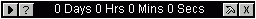



## Count Down Sticker \- Date & Time

### Description

Count down counter for any date & time which

will stick on window desktop. Featured dual

language setting, English & German for this

version. Allow always on top and side bounding.
 
### More Info
 
Target date & time

target date & time will be saved in the text file format automatically when the program terminated and will be auto fetch into the program setting on next loading.

time/date left for the desired date & time

             |
---                |---
**Submitted On**   |2000-05-24 11:32:14
**By**             |[Ong Hui Lam](https://github.com/Planet-Source-Code/PSCIndex/blob/master/ByAuthor/ong-hui-lam.md)
**Level**          |Intermediate
**User Rating**    |5.0 (10 globes from 2 users)
**Compatibility**  |VB 5\.0, VB 6\.0
**Category**       |[Complete Applications](https://github.com/Planet-Source-Code/PSCIndex/blob/master/ByCategory/complete-applications__1-27.md)
**World**          |[Visual Basic](https://github.com/Planet-Source-Code/PSCIndex/blob/master/ByWorld/visual-basic.md)
**Archive File**   |[CODE\_UPLOAD92748242000\.zip](https://github.com/Planet-Source-Code/ong-hui-lam-count-down-sticker-date-time__1-10979/archive/master.zip)

